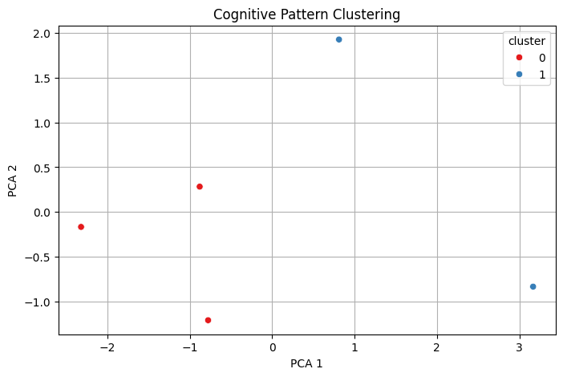

# Voice-Based Cognitive Decline Pattern Detection

## Task Details
- **Task Name**: Voice-Based Cognitive Decline Pattern Detection
- **Register Number**: [RA2111003040089]
- **Email**: [ia2492@srmist.edu.in]
- **Name**: [Izhan Abdullah A]

## Step 1: Import Required Libraries


```python
import os
import librosa
import numpy as np
import pandas as pd
import matplotlib.pyplot as plt
import seaborn as sns
import speech_recognition as sr
from sklearn.preprocessing import StandardScaler
from sklearn.decomposition import PCA
from sklearn.cluster import KMeans
import warnings
warnings.filterwarnings('ignore')

```

## Step 2: Define Feature Extraction for Audio


```python
def extract_audio_features(file_path):
    y, sr = librosa.load(file_path, sr=None)
    duration = librosa.get_duration(y=y, sr=sr)

    pitches, magnitudes = librosa.piptrack(y=y, sr=sr)
    pitch_values = pitches[magnitudes > np.median(magnitudes)]
    avg_pitch = np.mean(pitch_values) if len(pitch_values) > 0 else 0
    pitch_var = np.var(pitch_values) if len(pitch_values) > 0 else 0

    intervals = librosa.effects.split(y, top_db=25)
    pause_count = len(intervals) - 1

    return {
        "duration": duration,
        "avg_pitch": avg_pitch,
        "pitch_var": pitch_var,
        "pause_count": pause_count
    }

```


```python
extract_audio_features("common_voice_en_40865225.wav")
```


    {'duration': 3.42,
     'avg_pitch': 1690.082,
     'pitch_var': 1243177.2,
     'pause_count': 4}


```python

```

## Step 3: Transcribe Audio + Extract Text Features


```python
def transcribe_audio(file_path):
    recognizer = sr.Recognizer()
    with sr.AudioFile(file_path) as source:
        audio = recognizer.record(source)
        try:
            text = recognizer.recognize_google(audio)
        except sr.UnknownValueError:
            text = ""
    return text

def extract_text_features(text):
    words = text.split()
    word_count = len(words)
    hesitation_markers = ["um", "uh", "erm"]
    hesitations = sum([text.lower().count(h) for h in hesitation_markers])
    avg_word_length = np.mean([len(w) for w in words]) if words else 0
    return {
        "word_count": word_count,
        "hesitations": hesitations,
        "avg_word_length": avg_word_length
    }

```


```python
text = transcribe_audio("common_voice_en_40865225.wav")
print("Transcript:", text)
extract_text_features(text)

```

    Transcript: in a pamphlet what is to be done
    


    {'word_count': 8, 'hesitations': 0, 'avg_word_length': 3.125}


```python

```

## Step 4: Combine All Features into One Row


```python
audio_feats = extract_audio_features("common_voice_en_40865225.wav")
transcript = transcribe_audio("common_voice_en_40865225.wav")
text_feats = extract_text_features(transcript)

combined_features = {**audio_feats, **text_feats, "filename": "common_voice_en_40865225.wav"}
df = pd.DataFrame([combined_features])
df.set_index("filename", inplace=True)
```


```python
df
```


<div>
<style scoped>
    .dataframe tbody tr th:only-of-type {
        vertical-align: middle;
    }

    .dataframe tbody tr th {
        vertical-align: top;
    }

    .dataframe thead th {
        text-align: right;
    }
</style>
<table border="1" class="dataframe">
  <thead>
    <tr style="text-align: right;">
      <th></th>
      <th>duration</th>
      <th>avg_pitch</th>
      <th>pitch_var</th>
      <th>pause_count</th>
      <th>word_count</th>
      <th>hesitations</th>
      <th>avg_word_length</th>
    </tr>
    <tr>
      <th>filename</th>
      <th></th>
      <th></th>
      <th></th>
      <th></th>
      <th></th>
      <th></th>
      <th></th>
    </tr>
  </thead>
  <tbody>
    <tr>
      <th>common_voice_en_40865225.wav</th>
      <td>3.42</td>
      <td>1690.082031</td>
      <td>1243177.25</td>
      <td>4</td>
      <td>8</td>
      <td>0</td>
      <td>3.125</td>
    </tr>
  </tbody>
</table>
</div>


```python

```


```python
audio_folder = r"C:\Users\Admin\Desktop\Voice-Based-Cognitive-Decline-Detection-main\Voice-Based-Cognitive-Decline-Detection-main\fake voice samples\audio_samples"
features = []

for filename in os.listdir(audio_folder):
    if filename.endswith(".wav"):
        path = os.path.join(audio_folder, filename)
        print(f"Processing: {filename}")
        audio_feats = extract_audio_features(path)
        text = transcribe_audio(path)
        text_feats = extract_text_features(text)
        combined = {**audio_feats, **text_feats, "filename": filename}
        features.append(combined)

df = pd.DataFrame(features)
df.set_index("filename", inplace=True)
df.fillna(0, inplace=True)
df

```

    Processing: common_voice_en_40865225.wav
    Processing: common_voice_en_40865481.wav
    Processing: common_voice_en_40865482.wav
    Processing: common_voice_en_40865483.wav
    Processing: common_voice_en_40865484.wav
    


<div>
<style scoped>
    .dataframe tbody tr th:only-of-type {
        vertical-align: middle;
    }

    .dataframe tbody tr th {
        vertical-align: top;
    }

    .dataframe thead th {
        text-align: right;
    }
</style>
<table border="1" class="dataframe">
  <thead>
    <tr style="text-align: right;">
      <th></th>
      <th>duration</th>
      <th>avg_pitch</th>
      <th>pitch_var</th>
      <th>pause_count</th>
      <th>word_count</th>
      <th>hesitations</th>
      <th>avg_word_length</th>
    </tr>
    <tr>
      <th>filename</th>
      <th></th>
      <th></th>
      <th></th>
      <th></th>
      <th></th>
      <th></th>
      <th></th>
    </tr>
  </thead>
  <tbody>
    <tr>
      <th>common_voice_en_40865225.wav</th>
      <td>3.420</td>
      <td>1690.082031</td>
      <td>1243177.250</td>
      <td>4</td>
      <td>8</td>
      <td>0</td>
      <td>3.125000</td>
    </tr>
    <tr>
      <th>common_voice_en_40865481.wav</th>
      <td>4.608</td>
      <td>1340.500977</td>
      <td>996770.125</td>
      <td>10</td>
      <td>9</td>
      <td>0</td>
      <td>4.777778</td>
    </tr>
    <tr>
      <th>common_voice_en_40865482.wav</th>
      <td>4.284</td>
      <td>1365.894897</td>
      <td>1104203.750</td>
      <td>4</td>
      <td>10</td>
      <td>0</td>
      <td>5.400000</td>
    </tr>
    <tr>
      <th>common_voice_en_40865483.wav</th>
      <td>5.220</td>
      <td>1566.147705</td>
      <td>1114854.250</td>
      <td>7</td>
      <td>13</td>
      <td>0</td>
      <td>4.615385</td>
    </tr>
    <tr>
      <th>common_voice_en_40865484.wav</th>
      <td>4.788</td>
      <td>1493.921753</td>
      <td>1119288.000</td>
      <td>3</td>
      <td>1</td>
      <td>0</td>
      <td>4.000000</td>
    </tr>
  </tbody>
</table>
</div>


```python

```

## Step 5: Clustering & Dimensionality Reduction


```python
scaler = StandardScaler()
scaled = scaler.fit_transform(df)

pca = PCA(n_components=2)
pca_components = pca.fit_transform(scaled)

kmeans = KMeans(n_clusters=2, random_state=42)
df["cluster"] = kmeans.fit_predict(scaled)
```


```python
df
```


<div>
<style scoped>
    .dataframe tbody tr th:only-of-type {
        vertical-align: middle;
    }

    .dataframe tbody tr th {
        vertical-align: top;
    }

    .dataframe thead th {
        text-align: right;
    }
</style>
<table border="1" class="dataframe">
  <thead>
    <tr style="text-align: right;">
      <th></th>
      <th>duration</th>
      <th>avg_pitch</th>
      <th>pitch_var</th>
      <th>pause_count</th>
      <th>word_count</th>
      <th>hesitations</th>
      <th>avg_word_length</th>
      <th>cluster</th>
    </tr>
    <tr>
      <th>filename</th>
      <th></th>
      <th></th>
      <th></th>
      <th></th>
      <th></th>
      <th></th>
      <th></th>
      <th></th>
    </tr>
  </thead>
  <tbody>
    <tr>
      <th>common_voice_en_40865225.wav</th>
      <td>3.420</td>
      <td>1690.082031</td>
      <td>1243177.250</td>
      <td>4</td>
      <td>8</td>
      <td>0</td>
      <td>3.125000</td>
      <td>1</td>
    </tr>
    <tr>
      <th>common_voice_en_40865481.wav</th>
      <td>4.608</td>
      <td>1340.500977</td>
      <td>996770.125</td>
      <td>10</td>
      <td>9</td>
      <td>0</td>
      <td>4.777778</td>
      <td>0</td>
    </tr>
    <tr>
      <th>common_voice_en_40865482.wav</th>
      <td>4.284</td>
      <td>1365.894897</td>
      <td>1104203.750</td>
      <td>4</td>
      <td>10</td>
      <td>0</td>
      <td>5.400000</td>
      <td>0</td>
    </tr>
    <tr>
      <th>common_voice_en_40865483.wav</th>
      <td>5.220</td>
      <td>1566.147705</td>
      <td>1114854.250</td>
      <td>7</td>
      <td>13</td>
      <td>0</td>
      <td>4.615385</td>
      <td>0</td>
    </tr>
    <tr>
      <th>common_voice_en_40865484.wav</th>
      <td>4.788</td>
      <td>1493.921753</td>
      <td>1119288.000</td>
      <td>3</td>
      <td>1</td>
      <td>0</td>
      <td>4.000000</td>
      <td>1</td>
    </tr>
  </tbody>
</table>
</div>


```python

```

## Step 6: Visualize Clusters


```python
plt.figure(figsize=(8, 5))
sns.scatterplot(x=pca_components[:, 0], y=pca_components[:, 1], hue=df["cluster"], palette='Set1')
plt.title("Cognitive Pattern Clustering")
plt.xlabel("PCA 1")
plt.ylabel("PCA 2")
plt.grid(True)
plt.show()

```


    

    


```python

```

## Step 7: Save Results


```python
df.to_csv("bulk_voice_features.csv")
print("Results saved as 'bulk_voice_features.csv'")
```

    Results saved as 'bulk_voice_features.csv'
    


```python

```
